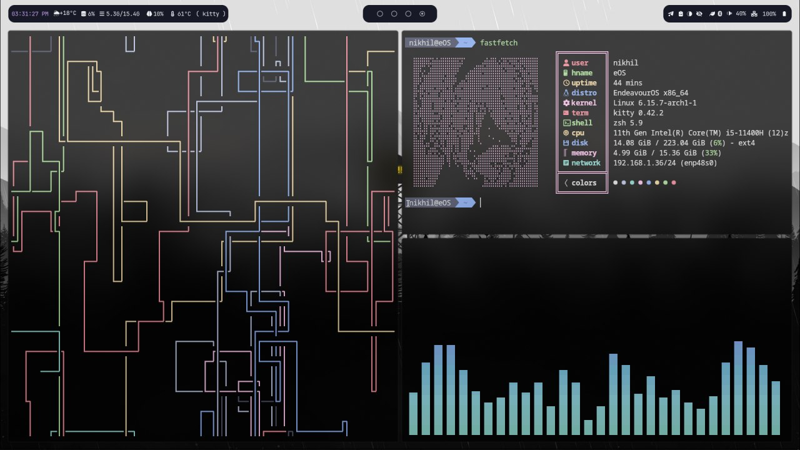
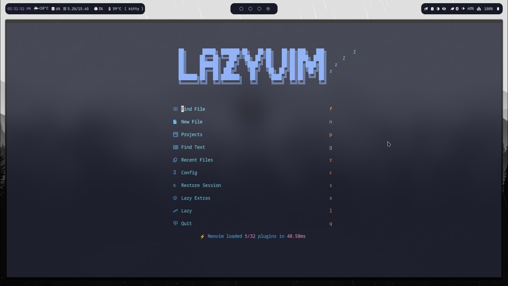
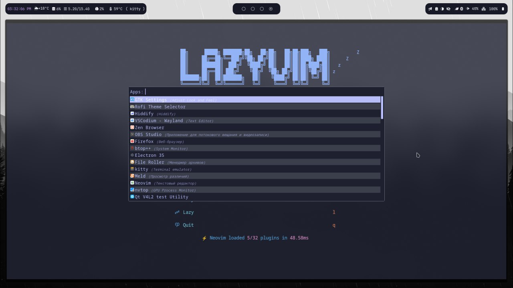

    <h3> My first hyprland dots 📁</h3>

    </img>
    </img>
    </img>

They are unfinished! I continue to fill them, use at your own risk

U need to install these pkgs:

            hyprland hyprpaper zsh kitty thunar rofi nwg-look waybar swww hypridle
            xdg-desktop-portal-hyprland pipewire wireplumber pamixer brightnessctl dunst polkit-kde-agent qt5-wayland qt6-wayland qt5ct qt6ct kvantum

I hope I didn't forget something :)
